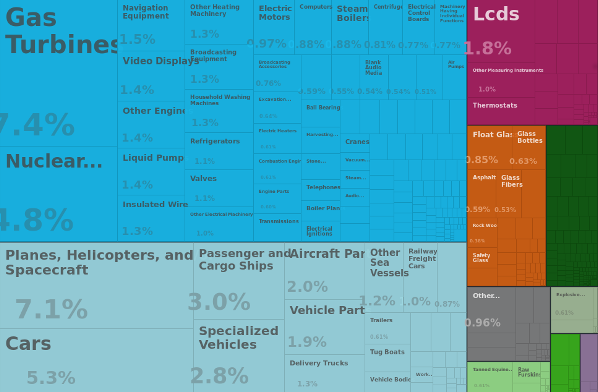

# Сайт на одной странице

## О чем хотим рассказать

**1. Примеры успеха:**

  - успешные кейсы выхода средних предприятий на внешние рынки и расширения географии продаж
  - что делают другие страны и зарубежные компании в обалсти экспорта 

**2. Куда бежать и что делать:**

  - возможности кооперации с иностранными партнерами 
  - доступные меры господдержки экспорта
  - инструкции по выводу компании на внешние рынки 
  
**3. Не пропустить:**

  - общеизвестные и неожиданные факты из статистики внешней торговли
  - цифровизация во внешней торговле (маркетплейсы, таможенное оформление, логистика, расчеты)   

## Полезный функционал сайта

- форма обратной связи
- карта экспорта (кейсов)
- датасеты по экспортерам
- тэги для тем (господдержка, кейс, статистика, рынки)

## Совсем несырьевой экспорт

Данные [COMTRADE](https://comtrade.un.org/) - ценный массив информации о внешней торговле - детализация идет до шестого знака товарных позиций, а это совсем конкретные наименования. Данные 
выверяются по встречным поставкам (и по стране-экспортеру и импортера), что
повышает их надежность. 

Если вы знаете код ТН ВЭД вашей продукции и не смотрели по нему COMTRADE - 
очень советуем это сделать (какие страны экспортируют, какие импортируют, как объемы 
импорта соотносятся с размером экономики страны).  

На основе COMTRADE сделано немало визуализаций, в том числе 
[Атлас экономической сложности](http://atlas.media.mit.edu/zl5b88). С помощью инструментов атласа 
мы немного углубились в несырьевой промышленный экспорт (без энергоносителей, металлов, химии,
леса и бумаги, сельского хозяйства и пищевки) и получили примерно такую картину:

Идеи:

- [ ] крупные товарные группы - скорее всего заняты крупными производителями
- [ ] воспроизвести этот рисунок на основе API атласа / jupyter notebook
- [ ] дать вариант с растущими или падающими группами товаров
- [ ] детализировать до HS6
- [ ] показать, как данные о страновой торговле могут показывать новые рыночные ниши
- [ ] показать на примере конкретной страны (Испания)
- [ ] корреляция поездок, включая туристические, и экспорта 

## План выступления "Малый и средний бизнес как экспортер"

- Малому бизнесу сложно на внешнем рынке (данные EC)

- Неэкспортер - 1 сделка - рост продаж: какая поддержка на какой стадии? 

- Экспортная стратегия и майские указы 

- Маркетинговая информация - что поменялось с цифровизацией 

- Что можно выжать из COMTRADE? Ориентация на масштабирование, межрегиональные продажи, nearest neighbour. 

- Типы продуктов и сервисов - миддлтех, коммодитизация, value chain

- Сколько стоит начать экспортировать? На каком объеме окупается представитель? 

- Банк: полка "маркетплейса", обмен информацией внутри пула заемщиков (пример - BPP Сбербанка)

- Сервисы Открытия для отраслевых ассоциаций, региональных агентств по поддержке экспорта 

- Традиционная и альтернативные модели экспорта

- Предложения партнеров, тренинги для предпринимателей

## Минпром о КППК

## Идей количественных исследований: датасет по "среднетехнологичным" экспортерам

- Фокусируемся на middle tech отраслях и средних предприятиях 
- Мы можем посмотреть на список экспортеров, например [тут]( 
http://www.ved.gov.ru/rus_export/russian_exporters/?loc=&doc_type=&search=&sourse=&region=&ogrn=&tnved_values=&okved_values=802%7C862%7C888%7C970%7C985&count=10&start=10)  
- По ИНН (и возможно, ОГРН) видим [бухгалтерскую отчетность предприятий](https://github.com/ru-corporate/sandbox) за 2017 год и ранее. Видим общие закономерности развития предприятий (изменение выручки, инвестиции в основной капитал, финансовая стабильность, способ финансирования). 
- Финансовые показатели покажут наиболее активно растущие предприятия и надежные контрагенты
- Через данные налоговой можно посмотреть занятость и налоговую задолженность
- Все вместе это говорит "проблемности" или успешности контрапартнера
- В списке есть контакты предприятий - им можно как минимум рассказать о датасете, спросить о планах развития
- Через код продукции можно связать с данными COMTRADE (показать сколько денег проходит мимо экспортеров), кто поставщики и кто покупатели продукции
- Какой бы была структура экспорта, если бы все экспортировали 20% выпуска? 
- Собственный опрос предприятий-экспортеров
- Личная страница компании на отдельном сайте с простой инфографикой
- Простая публикация pdf-latex, ноутбук collab

Примеры компаний:

- [Челябинский радиозавод](http://www.ved.gov.ru/rus_export/russian_exporters/?id=49921)
- [Ангстрем-Т](http://www.ved.gov.ru/rus_export/russian_exporters/?id=43164)
- [Энерголуч](http://www.ved.gov.ru/rus_export/russian_exporters/?id=44732) (светильники для нефтянки)
- сайт некоторых компаний закрыты, содержание каталога очень неоднородное, не ясен размер компании 

Что на выходе:

- "цифровой каталог" списка производителей по коду ТН ВЭД с данными о финансах компании

Кому в принципе интересен этот набор данных:

- зарубежные покупатели (кто эти странные русские, что у них можно купить, через кого)
- институты поддержки (понимать кого охватывают, а кого нет, что хотит экспортеры)
- отраслевые ассоциации (лучше представлять деятлеьность своих участников)
- банки, финансирующие экспорт (предложить торговое финансирование)
- торгпредства (с кем работают, кого еще могут представлять)

## Российская статистика и аналитика

- http://www.customs.ru/index.php?option=com_content&view=article&id=13858&Itemid=2095
- Росстат
- Счетная палата 
- РЭЦ
